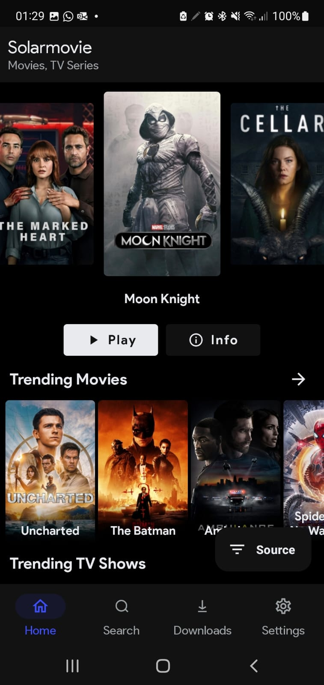
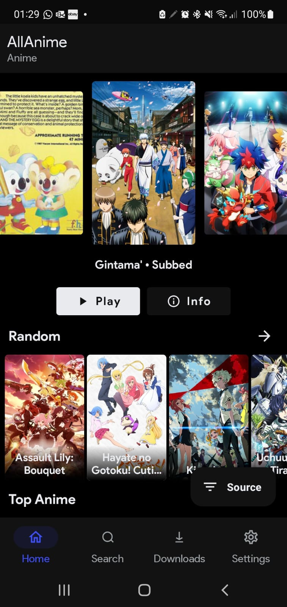
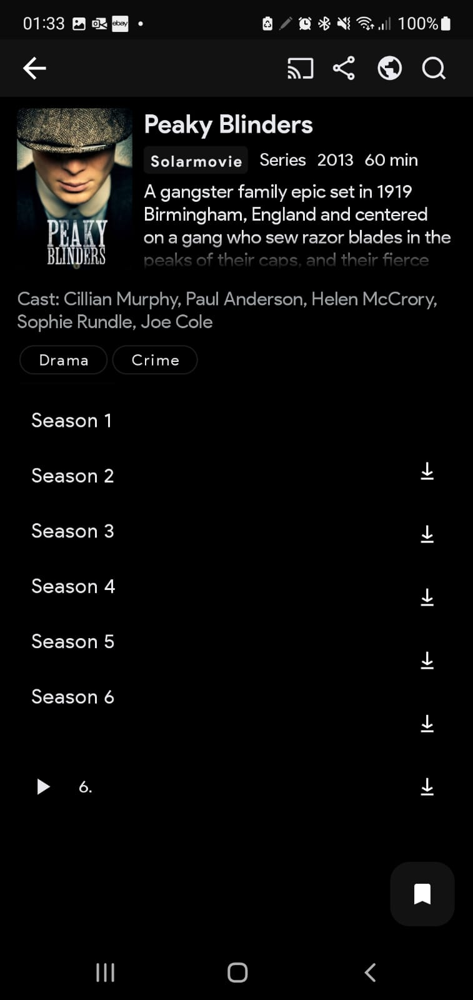

# CloudStream
Android app for streaming and downloading Movies, TV-Series and Anime.

## Download App

## Features

- Zero Ads, Zero Porn
- No Tracking/Analytics
- Bookmarks
- Allows you to download and stream movies, tv-shows and anime
- Chromecast

## App Screenshots

  
  
  

## Supported Languages

- 🇱🇧 Arabic
- 🇳🇱 Dutch
- 🇬🇧 English
- 🇫🇷 French
- 🇩🇪 German
- 🇬🇷 Greek
- 🇮🇳 Hindi
- 🇮🇹 Italian
- 🇲🇰 Macedonian
- 🇮🇳 Malayalam
- 🇳🇴 Norsk
- 🇵🇱 Polish
- 🇧🇷 Portuguese (Brazil)
- 🇷🇴 Romanian
- 🇪🇸 Spanish
- 🇸🇪 Swedish
- 🇵🇭 Tagalog
- 🇹🇷 Turkish
- 🇻🇳 Vietnamese

## Disclaimer

Any legal issues regarding the content on this application should be taken up with the actual file hosts and providers themselves as we are not affiliated with them.
In case of copyright infringement, please directly contact the responsible parties or the streaming websites.

The app is purely for educational and personal use.
CloudStream does not host any content on the app, and has no control over what media is put up or taken down. CloudStream  functions like any other search engine, such as Google. CloudStream  does not host, upload or manage any videos, films or content. It simply crawls, aggregates and displayes links in a convenient, user-friendly interface.

It merely scrapes 3rd-party websites that are publicly accessable via any regular web browser. It is the responsibility of user to avoid any actions that might violate the laws governing his/her locality. Use CloudStream at your own risk.

## Credits
App bootstrapped with https://github.com/LagradOst/CloudStream-3 check it out!